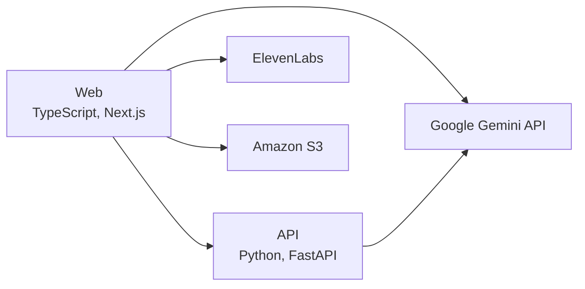

# Clockwise

Clockwise is a dementia screening tool that runs the Clock Drawing Test with a voice agent guiding the patient while a camera watches the drawing. It was built at the CSB Honors Hackathon 2026, and it combines live Gemini analysis of the drawing with speech graph metrics from the patient's transcript into a risk score and a PDF clinical report.

